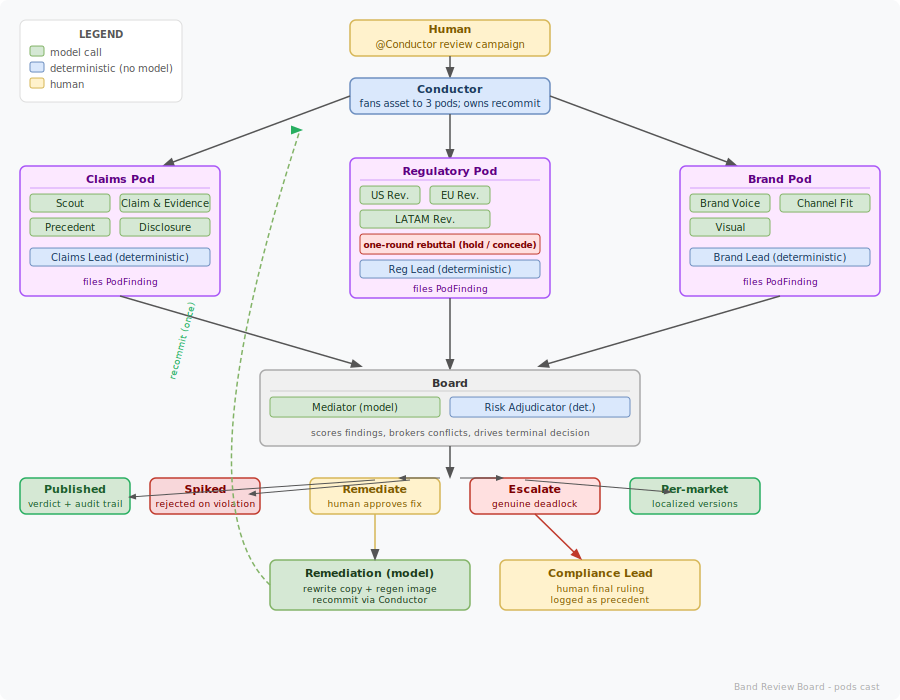
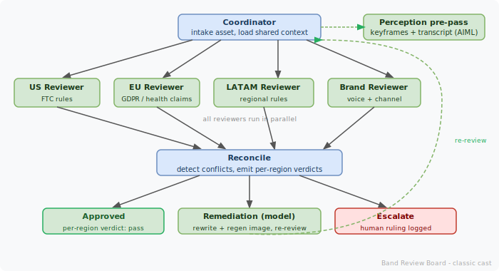

# Band Review Board

A marketing-compliance review board built on [band.ai](https://band.ai). A brand ships a whole campaign (a product with many marketing materials: video, posts, images, banners) into a shared Band room, and specialist agents clear each material against every target market's advertising and regulatory rules before it publishes, catching the cross-border conflicts a single legal team misses and proving every verdict with an audit trail.

Built for the [Band of Agents Hackathon](https://lablab.ai) (lablab.ai), June 2026. Solo build.

**Hosted demo:** [artifact-viewer-one.vercel.app](https://artifact-viewer-one.vercel.app)

> The compliance content here is a hackathon demo, not legal advice.

## Why this exists

Not a content-review tool, a regulatory risk shield. "Save the marketing team some time" is a nice-to-have. "Stop shipping a claim that triggers a fine worth 4% of global revenue" is a budget line nobody argues with. The pain is multiplicative: every campaign, every asset, every market, continuously. A single asset sold into several markets faces parallel, stacked liability, because each jurisdiction sets its own rules, ceilings, and required disclosures. That stacked conflict is exactly what these agents surface and a single reviewer misses.

The safe anchors on the downside: GDPR fines up to 20 million euro or 4% of global turnover; the UK DMCC Act up to 10% of global turnover; US FTC penalties per violation on unsubstantiated claims, where one campaign is many violations. Before: six markets, a week or more each, an uncapped fine if one slips. After: minutes, one human ruling on the genuine gray area, every verdict traceable to a rule and an agent.

## Why this is not a pipeline

The interesting part is the conflict, not the workflow. The agents do not run checks in a line and merge a checklist. They hold competing mandates and have to reconcile them:

- A quantified or efficacy claim ("clinically proven to boost your immune system") can pass in the US with substantiation and be an unauthorized health claim in the EU.
- An EU fix can require a disclosure or consent line the US version never needed.
- A localized rewrite that fixes the legal problem can drift off-brand, which the brand reviewers push back on.

So the reviewers do not produce one merged checklist. The genuine agent-to-agent debate is the originality here: in the regulatory pod, when two region reviewers split on the same span, the Reg Lead runs a one-round rebuttal where each blocking region holds or concedes, on the record, before anything consolidates. That negotiation is the point. Band is the layer it happens on: every agent is a first-class participant in the room that coordinates by @mention and narrates its reasoning, not a wrapper around a script.

Two orchestration topologies ship and coexist. The live workflow is the **pods cast** ("blackboard pods on a decision spine"), the real Band.ai showcase you connect with `pnpm agents`: 17 agents plus a human, organized into three deliberating pods on a deterministic decision spine. A lighter **classic cast** (Coordinator to US/EU/LATAM/Brand to Reconcile, per-region verdicts) backs the web portal's "Run review" button and is reached with `pnpm serve`, `pnpm serve:band`, or `pnpm agents:classic`.

## Workflow diagrams

### Pods cast (the live Band.ai showcase)

<p align="center">

</p>

<!--
<svg xmlns="http://www.w3.org/2000/svg" viewBox="0 0 900 700" width="900" height="700" font-family="ui-monospace,SFMono-Regular,Menlo,monospace" font-size="12">
  <defs>
    <marker id="arrow" markerWidth="8" markerHeight="8" refX="6" refY="3" orient="auto">
      <path d="M0,0 L0,6 L8,3 z" fill="#555"/>
    </marker>
    <marker id="arrow-red" markerWidth="8" markerHeight="8" refX="6" refY="3" orient="auto">
      <path d="M0,0 L0,6 L8,3 z" fill="#c0392b"/>
    </marker>
    <marker id="arrow-green" markerWidth="8" markerHeight="8" refX="6" refY="3" orient="auto">
      <path d="M0,0 L0,6 L8,3 z" fill="#27ae60"/>
    </marker>
  </defs>

  <rect width="900" height="700" fill="#f8f9fa" rx="8"/>

  <!-- Legend -->
  <rect x="20" y="20" width="160" height="80" fill="white" rx="6" stroke="#ddd" stroke-width="1"/>
  <text x="100" y="38" text-anchor="middle" fill="#555" font-size="10" font-weight="bold">LEGEND</text>
  <rect x="30" y="46" width="14" height="10" fill="#d5e8d4" rx="2" stroke="#82b366" stroke-width="1"/>
  <text x="50" y="56" fill="#555" font-size="10">model call</text>
  <rect x="30" y="62" width="14" height="10" fill="#dae8fc" rx="2" stroke="#6c8ebf" stroke-width="1"/>
  <text x="50" y="72" fill="#555" font-size="10">deterministic (no model)</text>
  <rect x="30" y="78" width="14" height="10" fill="#fff2cc" rx="2" stroke="#d6b656" stroke-width="1"/>
  <text x="50" y="88" fill="#555" font-size="10">human</text>

  <!-- Row 1: Human trigger -->
  <rect x="350" y="20" width="200" height="36" rx="6" fill="#fff2cc" stroke="#d6b656" stroke-width="1.5"/>
  <text x="450" y="33" text-anchor="middle" fill="#7d5a00" font-size="11" font-weight="bold">Human</text>
  <text x="450" y="48" text-anchor="middle" fill="#7d5a00" font-size="10">@Conductor review campaign</text>

  <line x1="450" y1="56" x2="450" y2="76" stroke="#555" stroke-width="1.5" marker-end="url(#arrow)"/>

  <!-- Row 2: Conductor -->
  <rect x="350" y="78" width="200" height="36" rx="6" fill="#dae8fc" stroke="#6c8ebf" stroke-width="1.5"/>
  <text x="450" y="93" text-anchor="middle" fill="#1a3a5c" font-size="11" font-weight="bold">Conductor</text>
  <text x="450" y="107" text-anchor="middle" fill="#1a3a5c" font-size="10">fans asset to 3 pods; owns recommit</text>

  <line x1="350" y1="96" x2="165" y2="165" stroke="#555" stroke-width="1.5" marker-end="url(#arrow)"/>
  <line x1="450" y1="114" x2="450" y2="158" stroke="#555" stroke-width="1.5" marker-end="url(#arrow)"/>
  <line x1="550" y1="96" x2="735" y2="165" stroke="#555" stroke-width="1.5" marker-end="url(#arrow)"/>

  <!-- Row 3: Three pods -->

  <!-- Claims pod -->
  <rect x="20" y="166" width="200" height="130" rx="6" fill="#fce8ff" stroke="#a855f7" stroke-width="1.5"/>
  <text x="120" y="183" text-anchor="middle" fill="#5b0080" font-size="11" font-weight="bold">Claims Pod</text>
  <line x1="30" y1="188" x2="210" y2="188" stroke="#a855f7" stroke-width="0.5"/>
  <rect x="30" y="194" width="80" height="18" rx="3" fill="#d5e8d4" stroke="#82b366" stroke-width="1"/>
  <text x="70" y="207" text-anchor="middle" fill="#1a3a1a" font-size="10">Scout</text>
  <rect x="120" y="194" width="90" height="18" rx="3" fill="#d5e8d4" stroke="#82b366" stroke-width="1"/>
  <text x="165" y="207" text-anchor="middle" fill="#1a3a1a" font-size="10">Claim &amp; Evidence</text>
  <rect x="30" y="218" width="80" height="18" rx="3" fill="#d5e8d4" stroke="#82b366" stroke-width="1"/>
  <text x="70" y="231" text-anchor="middle" fill="#1a3a1a" font-size="10">Precedent</text>
  <rect x="120" y="218" width="90" height="18" rx="3" fill="#d5e8d4" stroke="#82b366" stroke-width="1"/>
  <text x="165" y="231" text-anchor="middle" fill="#1a3a1a" font-size="10">Disclosure</text>
  <rect x="30" y="248" width="180" height="18" rx="3" fill="#dae8fc" stroke="#6c8ebf" stroke-width="1"/>
  <text x="120" y="261" text-anchor="middle" fill="#1a3a5c" font-size="10">Claims Lead (deterministic)</text>
  <text x="120" y="285" text-anchor="middle" fill="#5b0080" font-size="9" font-style="italic">files PodFinding</text>

  <!-- Regulatory pod -->
  <rect x="350" y="158" width="200" height="140" rx="6" fill="#fce8ff" stroke="#a855f7" stroke-width="1.5"/>
  <text x="450" y="175" text-anchor="middle" fill="#5b0080" font-size="11" font-weight="bold">Regulatory Pod</text>
  <line x1="360" y1="180" x2="540" y2="180" stroke="#a855f7" stroke-width="0.5"/>
  <rect x="360" y="186" width="60" height="18" rx="3" fill="#d5e8d4" stroke="#82b366" stroke-width="1"/>
  <text x="390" y="199" text-anchor="middle" fill="#1a3a1a" font-size="10">US Rev.</text>
  <rect x="430" y="186" width="60" height="18" rx="3" fill="#d5e8d4" stroke="#82b366" stroke-width="1"/>
  <text x="460" y="199" text-anchor="middle" fill="#1a3a1a" font-size="10">EU Rev.</text>
  <rect x="360" y="210" width="130" height="18" rx="3" fill="#d5e8d4" stroke="#82b366" stroke-width="1"/>
  <text x="425" y="223" text-anchor="middle" fill="#1a3a1a" font-size="10">LATAM Rev.</text>
  <rect x="360" y="234" width="180" height="20" rx="3" fill="#ffe0e0" stroke="#c0392b" stroke-width="1"/>
  <text x="450" y="248" text-anchor="middle" fill="#7a0000" font-size="9" font-weight="bold">one-round rebuttal (hold / concede)</text>
  <rect x="360" y="260" width="180" height="18" rx="3" fill="#dae8fc" stroke="#6c8ebf" stroke-width="1"/>
  <text x="450" y="273" text-anchor="middle" fill="#1a3a5c" font-size="10">Reg Lead (deterministic)</text>
  <text x="450" y="292" text-anchor="middle" fill="#5b0080" font-size="9" font-style="italic">files PodFinding</text>

  <!-- Brand pod -->
  <rect x="680" y="166" width="200" height="130" rx="6" fill="#fce8ff" stroke="#a855f7" stroke-width="1.5"/>
  <text x="780" y="183" text-anchor="middle" fill="#5b0080" font-size="11" font-weight="bold">Brand Pod</text>
  <line x1="690" y1="188" x2="870" y2="188" stroke="#a855f7" stroke-width="0.5"/>
  <rect x="690" y="194" width="80" height="18" rx="3" fill="#d5e8d4" stroke="#82b366" stroke-width="1"/>
  <text x="730" y="207" text-anchor="middle" fill="#1a3a1a" font-size="10">Brand Voice</text>
  <rect x="780" y="194" width="90" height="18" rx="3" fill="#d5e8d4" stroke="#82b366" stroke-width="1"/>
  <text x="825" y="207" text-anchor="middle" fill="#1a3a1a" font-size="10">Channel Fit</text>
  <rect x="690" y="218" width="80" height="18" rx="3" fill="#d5e8d4" stroke="#82b366" stroke-width="1"/>
  <text x="730" y="231" text-anchor="middle" fill="#1a3a1a" font-size="10">Visual</text>
  <rect x="690" y="248" width="180" height="18" rx="3" fill="#dae8fc" stroke="#6c8ebf" stroke-width="1"/>
  <text x="780" y="261" text-anchor="middle" fill="#1a3a5c" font-size="10">Brand Lead (deterministic)</text>
  <text x="780" y="285" text-anchor="middle" fill="#5b0080" font-size="9" font-style="italic">files PodFinding</text>

  <!-- Arrows: pods -> Board -->
  <line x1="120" y1="296" x2="360" y2="366" stroke="#555" stroke-width="1.5" marker-end="url(#arrow)"/>
  <line x1="450" y1="298" x2="450" y2="368" stroke="#555" stroke-width="1.5" marker-end="url(#arrow)"/>
  <line x1="780" y1="296" x2="540" y2="366" stroke="#555" stroke-width="1.5" marker-end="url(#arrow)"/>

  <!-- Row 4: Board -->
  <rect x="260" y="370" width="380" height="76" rx="6" fill="#f0f0f0" stroke="#aaa" stroke-width="1.5"/>
  <text x="450" y="387" text-anchor="middle" fill="#333" font-size="11" font-weight="bold">Board</text>
  <line x1="270" y1="391" x2="630" y2="391" stroke="#aaa" stroke-width="0.5"/>
  <rect x="270" y="397" width="170" height="20" rx="3" fill="#d5e8d4" stroke="#82b366" stroke-width="1"/>
  <text x="355" y="411" text-anchor="middle" fill="#1a3a1a" font-size="10">Mediator (model)</text>
  <rect x="450" y="397" width="180" height="20" rx="3" fill="#dae8fc" stroke="#6c8ebf" stroke-width="1"/>
  <text x="540" y="411" text-anchor="middle" fill="#1a3a5c" font-size="10">Risk Adjudicator (det.)</text>
  <text x="450" y="436" text-anchor="middle" fill="#555" font-size="9" font-style="italic">scores findings, brokers conflicts, drives terminal decision</text>

  <line x1="450" y1="446" x2="450" y2="476" stroke="#555" stroke-width="1.5" marker-end="url(#arrow)"/>

  <!-- Row 5: Outcomes -->
  <rect x="20" y="478" width="110" height="36" rx="6" fill="#d5e8d4" stroke="#27ae60" stroke-width="1.5"/>
  <text x="75" y="493" text-anchor="middle" fill="#1a5c2a" font-size="11" font-weight="bold">Published</text>
  <text x="75" y="507" text-anchor="middle" fill="#1a5c2a" font-size="9">verdict + audit trail</text>

  <rect x="150" y="478" width="110" height="36" rx="6" fill="#f8d7da" stroke="#c0392b" stroke-width="1.5"/>
  <text x="205" y="493" text-anchor="middle" fill="#7a0000" font-size="11" font-weight="bold">Spiked</text>
  <text x="205" y="507" text-anchor="middle" fill="#7a0000" font-size="9">rejected on violation</text>

  <rect x="310" y="478" width="130" height="36" rx="6" fill="#fff2cc" stroke="#d6b656" stroke-width="1.5"/>
  <text x="375" y="493" text-anchor="middle" fill="#7d5a00" font-size="11" font-weight="bold">Remediate</text>
  <text x="375" y="507" text-anchor="middle" fill="#7d5a00" font-size="9">human approves fix</text>

  <rect x="470" y="478" width="130" height="36" rx="6" fill="#ffe0e0" stroke="#c0392b" stroke-width="1.5"/>
  <text x="535" y="493" text-anchor="middle" fill="#7a0000" font-size="11" font-weight="bold">Escalate</text>
  <text x="535" y="507" text-anchor="middle" fill="#7a0000" font-size="9">genuine deadlock</text>

  <rect x="630" y="478" width="130" height="36" rx="6" fill="#d5e8d4" stroke="#27ae60" stroke-width="1.5"/>
  <text x="695" y="493" text-anchor="middle" fill="#1a5c2a" font-size="11" font-weight="bold">Per-market</text>
  <text x="695" y="507" text-anchor="middle" fill="#1a5c2a" font-size="9">localized versions</text>

  <!-- Fan arrows from board to outcomes -->
  <line x1="375" y1="480" x2="130" y2="497" stroke="#555" stroke-width="1" marker-end="url(#arrow)"/>
  <line x1="410" y1="480" x2="250" y2="494" stroke="#555" stroke-width="1" marker-end="url(#arrow)"/>
  <line x1="440" y1="478" x2="400" y2="478" stroke="#555" stroke-width="1" marker-end="url(#arrow)"/>
  <line x1="460" y1="478" x2="502" y2="478" stroke="#555" stroke-width="1" marker-end="url(#arrow)"/>
  <line x1="525" y1="480" x2="670" y2="492" stroke="#555" stroke-width="1" marker-end="url(#arrow)"/>

  <!-- Row 6: Remediation + Compliance Lead -->
  <rect x="270" y="560" width="200" height="50" rx="6" fill="#d5e8d4" stroke="#82b366" stroke-width="1.5"/>
  <text x="370" y="577" text-anchor="middle" fill="#1a3a1a" font-size="11" font-weight="bold">Remediation (model)</text>
  <text x="370" y="592" text-anchor="middle" fill="#1a3a1a" font-size="9">rewrite copy + regen image</text>
  <text x="370" y="603" text-anchor="middle" fill="#1a3a1a" font-size="9">recommit via Conductor</text>

  <rect x="500" y="560" width="200" height="50" rx="6" fill="#fff2cc" stroke="#d6b656" stroke-width="1.5"/>
  <text x="600" y="577" text-anchor="middle" fill="#7d5a00" font-size="11" font-weight="bold">Compliance Lead</text>
  <text x="600" y="592" text-anchor="middle" fill="#7d5a00" font-size="9">human final ruling</text>
  <text x="600" y="603" text-anchor="middle" fill="#7d5a00" font-size="9">logged as precedent</text>

  <line x1="375" y1="514" x2="375" y2="558" stroke="#d6b656" stroke-width="1.5" marker-end="url(#arrow)"/>
  <line x1="535" y1="514" x2="580" y2="558" stroke="#c0392b" stroke-width="1.5" marker-end="url(#arrow-red)"/>

  <!-- Recommit arc back to Conductor -->
  <path d="M 270,585 Q 180,500 300,130" fill="none" stroke="#82b366" stroke-width="1.5" stroke-dasharray="5,3" marker-end="url(#arrow-green)"/>
  <text x="175" y="380" fill="#27ae60" font-size="9" transform="rotate(-75,175,380)">recommit (once)</text>

  <text x="880" y="690" text-anchor="end" fill="#aaa" font-size="9">Band Review Board - pods cast</text>
</svg>
-->

### Classic cast (portal "Run review" flow)

<p align="center">

</p>

<!--
<svg xmlns="http://www.w3.org/2000/svg" viewBox="0 0 700 380" width="700" height="380" font-family="ui-monospace,SFMono-Regular,Menlo,monospace" font-size="12">
  <defs>
    <marker id="arr2" markerWidth="8" markerHeight="8" refX="6" refY="3" orient="auto">
      <path d="M0,0 L0,6 L8,3 z" fill="#555"/>
    </marker>
    <marker id="arr2-green" markerWidth="8" markerHeight="8" refX="6" refY="3" orient="auto">
      <path d="M0,0 L0,6 L8,3 z" fill="#27ae60"/>
    </marker>
  </defs>

  <rect width="700" height="380" fill="#f8f9fa" rx="8"/>

  <!-- Row 1: Coordinator -->
  <rect x="250" y="20" width="200" height="36" rx="6" fill="#dae8fc" stroke="#6c8ebf" stroke-width="1.5"/>
  <text x="350" y="35" text-anchor="middle" fill="#1a3a5c" font-size="11" font-weight="bold">Coordinator</text>
  <text x="350" y="49" text-anchor="middle" fill="#1a3a5c" font-size="10">intake asset, load shared context</text>

  <!-- Perception pre-pass -->
  <rect x="510" y="20" width="170" height="36" rx="6" fill="#d5e8d4" stroke="#82b366" stroke-width="1.5"/>
  <text x="595" y="35" text-anchor="middle" fill="#1a3a1a" font-size="11" font-weight="bold">Perception pre-pass</text>
  <text x="595" y="49" text-anchor="middle" fill="#1a3a1a" font-size="10">keyframes + transcript (AIML)</text>
  <line x1="450" y1="38" x2="510" y2="38" stroke="#82b366" stroke-width="1.5" stroke-dasharray="4,2" marker-end="url(#arr2-green)"/>

  <!-- Arrows Coordinator to reviewers -->
  <line x1="270" y1="56" x2="90" y2="108" stroke="#555" stroke-width="1.5" marker-end="url(#arr2)"/>
  <line x1="310" y1="56" x2="230" y2="108" stroke="#555" stroke-width="1.5" marker-end="url(#arr2)"/>
  <line x1="390" y1="56" x2="390" y2="108" stroke="#555" stroke-width="1.5" marker-end="url(#arr2)"/>
  <line x1="430" y1="56" x2="550" y2="108" stroke="#555" stroke-width="1.5" marker-end="url(#arr2)"/>

  <!-- Row 2: Four reviewers (parallel) -->
  <rect x="20" y="110" width="120" height="40" rx="6" fill="#d5e8d4" stroke="#82b366" stroke-width="1.5"/>
  <text x="80" y="126" text-anchor="middle" fill="#1a3a1a" font-size="11" font-weight="bold">US Reviewer</text>
  <text x="80" y="142" text-anchor="middle" fill="#1a3a1a" font-size="9">FTC rules</text>

  <rect x="160" y="110" width="120" height="40" rx="6" fill="#d5e8d4" stroke="#82b366" stroke-width="1.5"/>
  <text x="220" y="126" text-anchor="middle" fill="#1a3a1a" font-size="11" font-weight="bold">EU Reviewer</text>
  <text x="220" y="142" text-anchor="middle" fill="#1a3a1a" font-size="9">GDPR / health claims</text>

  <rect x="300" y="110" width="140" height="40" rx="6" fill="#d5e8d4" stroke="#82b366" stroke-width="1.5"/>
  <text x="370" y="126" text-anchor="middle" fill="#1a3a1a" font-size="11" font-weight="bold">LATAM Reviewer</text>
  <text x="370" y="142" text-anchor="middle" fill="#1a3a1a" font-size="9">regional rules</text>

  <rect x="460" y="110" width="130" height="40" rx="6" fill="#d5e8d4" stroke="#82b366" stroke-width="1.5"/>
  <text x="525" y="126" text-anchor="middle" fill="#1a3a1a" font-size="11" font-weight="bold">Brand Reviewer</text>
  <text x="525" y="142" text-anchor="middle" fill="#1a3a1a" font-size="9">voice + channel</text>

  <text x="350" y="170" text-anchor="middle" fill="#888" font-size="9" font-style="italic">all reviewers run in parallel</text>

  <!-- Arrows reviewers to Reconcile -->
  <line x1="80" y1="150" x2="280" y2="208" stroke="#555" stroke-width="1.5" marker-end="url(#arr2)"/>
  <line x1="220" y1="150" x2="315" y2="208" stroke="#555" stroke-width="1.5" marker-end="url(#arr2)"/>
  <line x1="370" y1="150" x2="385" y2="208" stroke="#555" stroke-width="1.5" marker-end="url(#arr2)"/>
  <line x1="525" y1="150" x2="455" y2="208" stroke="#555" stroke-width="1.5" marker-end="url(#arr2)"/>

  <!-- Row 3: Reconcile -->
  <rect x="220" y="210" width="260" height="36" rx="6" fill="#dae8fc" stroke="#6c8ebf" stroke-width="1.5"/>
  <text x="350" y="225" text-anchor="middle" fill="#1a3a5c" font-size="11" font-weight="bold">Reconcile</text>
  <text x="350" y="241" text-anchor="middle" fill="#1a3a5c" font-size="10">detect conflicts, emit per-region verdicts</text>

  <!-- Arrows Reconcile to outcomes -->
  <line x1="280" y1="246" x2="160" y2="290" stroke="#555" stroke-width="1.5" marker-end="url(#arr2)"/>
  <line x1="350" y1="246" x2="350" y2="290" stroke="#555" stroke-width="1.5" marker-end="url(#arr2)"/>
  <line x1="420" y1="246" x2="540" y2="290" stroke="#555" stroke-width="1.5" marker-end="url(#arr2)"/>

  <!-- Row 4: Outcomes -->
  <rect x="60" y="292" width="170" height="36" rx="6" fill="#d5e8d4" stroke="#27ae60" stroke-width="1.5"/>
  <text x="145" y="307" text-anchor="middle" fill="#1a5c2a" font-size="11" font-weight="bold">Approved</text>
  <text x="145" y="323" text-anchor="middle" fill="#1a5c2a" font-size="9">per-region verdict: pass</text>

  <rect x="250" y="292" width="200" height="36" rx="6" fill="#d5e8d4" stroke="#82b366" stroke-width="1.5"/>
  <text x="350" y="307" text-anchor="middle" fill="#1a3a1a" font-size="11" font-weight="bold">Remediation (model)</text>
  <text x="350" y="323" text-anchor="middle" fill="#1a3a1a" font-size="9">rewrite + regen image, re-review</text>

  <rect x="470" y="292" width="170" height="36" rx="6" fill="#ffe0e0" stroke="#c0392b" stroke-width="1.5"/>
  <text x="555" y="307" text-anchor="middle" fill="#7a0000" font-size="11" font-weight="bold">Escalate</text>
  <text x="555" y="323" text-anchor="middle" fill="#7a0000" font-size="9">human ruling logged</text>

  <!-- Remediation loop arrow -->
  <path d="M 350,328 Q 620,340 620,140 Q 620,56 450,56" fill="none" stroke="#82b366" stroke-width="1.5" stroke-dasharray="5,3" marker-end="url(#arr2-green)"/>
  <text x="638" y="200" fill="#27ae60" font-size="9">re-review</text>

  <text x="690" y="372" text-anchor="end" fill="#aaa" font-size="9">Band Review Board - classic cast</text>
</svg>
-->

## Campaigns, cascading dossier, and multimodal review

A review is not limited to one asset. A campaign is a product with many materials (a hero video that owns its cutdown posts and thumbnail, standalone posts, banners). Each material is negotiated per region concurrently; the campaign verdict is an observation over the per-material verdicts (worst-case per region plus a material x region matrix), never a gate that serializes the work.

- **Cascading dossier:** a campaign carries a shared source-of-truth (approved claims, substantiation, approved info, uploaded sources) that cascades into every reviewer's prompt. Edit it once and it re-grounds every material.
- **Multimodal perception:** a pre-pass actually sees each video and image (sampled keyframes) and hears the audio (transcript) via AIML, then feeds those text artifacts to every reviewer.
- **Rulebook smart import:** upload a `.md` (parsed into rules by a model) or `.json` rulebook, or apply a curated preset, instead of entering rules one by one.

Full details in `docs/CAMPAIGNS.md`.

## The cast

The live pods cast is 17 agents plus a human (the Compliance Lead).

| Agent | Objective | Calls a model |
|---|---|---|
| Conductor | Fan the asset to the three pods, own the single recommit; the only agent a human tags | No (deterministic) |
| Scout | Map the risky surfaces (claims, CTAs, image) as work-items | Yes |
| Claim & Evidence | Flag claims not substantiated by the asset | Yes |
| Precedent | Attach relevant prior rulings | Yes |
| Disclosure | Draft any mandatory disclosure text | Yes |
| US / EU / LATAM reviewers | Check against each market's rulebook; in the Reg pod, hold or concede a contested span in the rebuttal round | Yes |
| Brand Voice / Channel Fit / Visual | Keep copy, format, and image on-brand | Yes |
| Claims / Regulatory / Brand Leads | Collect positions, run the rebuttal (Reg Lead), file one consolidated finding | No (deterministic) |
| Mediator | Broker a cross-pod conflict into the smallest resolution, or report a deadlock | Yes |
| Remediation | Rewrite blocked copy and regenerate a localized image, recommit | Yes |
| Risk Adjudicator | Score the board, run the mediation/remediation cycle, drive the terminal decision (published/spiked/escalated), summon the human | No (deterministic) |
| Compliance Lead | Rule on the genuine deadlock; ruling logged as precedent | Human, not an agent |

The orchestration steps (Conductor, pod leads, Risk Adjudicator) are deterministic on purpose. Routing and the verdict logic are auditable rather than left to a model. The classic cast keeps the same discipline (the coordinator and reconcile steps are deterministic).

## Multi-model by design

Each model-calling agent runs the model family that fits its job. `MODEL_MODE` switches the whole fleet behind one interface (`src/models/route.ts`). For the live Band.ai room, `MODEL_MODE=vertex` runs everything on Gemini/Vertex from a single GCP credential.

| Agent | `aiml` (main path) | `dev` (cost-saver) |
|---|---|---|
| Scout, LATAM | Llama 3.1 8B | Llama 3.1 8B (Featherless, open model) |
| US reviewer | OpenAI GPT-5 | Claude Sonnet (Bedrock) |
| EU reviewer, Claim & Evidence | Gemini 2.5 Pro | Gemini (Vertex) |
| LATAM reviewer | Llama 3.1 8B | Llama 3.1 8B (Featherless) |
| Precedent, Channel, Visual | Gemini 2.5 Flash | Gemini (Vertex) |
| Disclosure | Claude Sonnet | Claude Sonnet (Bedrock) |
| Brand reviewer / Brand Voice | Claude Haiku 4.5 | Claude Haiku (Bedrock) |
| Mediator | Claude Opus | Claude Opus (Bedrock) |
| Remediation (copy) | DeepSeek | Claude Sonnet (Bedrock) |
| Remediation (image) | Gemini 2.5 Flash Image ("Nano Banana") | Gemini (Vertex) |
| Perception (vision) | vision-capable model, reads keyframes/images | (MODEL_MODE fallback) |
| Perception (audio) | Whisper-class transcription | (MODEL_MODE fallback) |

- `vertex` routes the whole fleet through GCP Vertex (Gemini) on one credential, the path used to stand up the live 17-agent Band.ai room with the least setup.
- `aiml` routes every agent through the [AI/ML API](https://aimlapi.com) OpenAI-compatible gateway, used for the high-visibility showcase calls and the Nano Banana image work.
- `dev` spreads volume across AWS Bedrock, GCP Vertex, and [Featherless](https://featherless.ai) (open-source inference) so the small AIML credit is not burned during development.
- All three modalities run through AIML: text (the reviewers), image (Nano Banana plus perception vision), and audio (perception transcription).

## A live run

On real models, the sample asset drives the full negotiation, not a scripted demo. A representative run:

```
Reg Lead: regulatory pod deliberating (3 members)
EU Reviewer rebuts on "clinically proven to boost your immune system": hold
EU Reviewer rebuts on "9 out of 10 users felt healthier in two weeks": hold
Reg Lead: regulatory pod: 8 findings, 3 conflict(s)
Risk Adjudicator: 3 conflict(s), consulting mediator
Mediator: no movement
Risk Adjudicator: remediate (attempt 1)
... asset recommits, pods re-deliberate ...
Risk Adjudicator: deadlock, escalating
Human ruling: spiked      ->      terminal: spiked
```

The EU reviewer genuinely holds its block on rebuttal, the pod files a real cross-region conflict, the board fails to mediate it, one remediation cycle runs, and the deadlock escalates to the human. Nothing about the outcome is hard-coded, so it varies run to run.

## Shared context

The agents reason against structured context in `assets/`:

- `brand-dna.json`: voice, approved and forbidden vocabulary, claim boundaries, channel norms.
- `rulebook.us.json`, `rulebook.eu.json`, `rulebook.latam.json`: the per-market rules each region reviewer applies.
- `presets/rulebook.*.json`: curated rulebook presets (US FTC, EU health claims, LATAM) for one-click import.
- `sample-campaign.json`: the demo campaign, a product with a dossier and several materials including a hero video that owns its posts and thumbnail.
- `sample-asset.json`, `sample-asset-adapt.json`: the legacy single-asset demos, including one whose claim passes in one market and fails in another.

## Stack

TypeScript, Node 22+, pnpm, ESM. Coordination through `@band-ai/sdk` behind a transport seam (a real band.ai transport and an in-process fake for tests). Findings and verdicts are validated with `zod`. Model calls go through a provider-agnostic `ModelClient` (the `openai` SDK for the AIML gateway, `@anthropic-ai/bedrock-sdk`, `@google/genai`) over a `string | ContentBlock[]` message seam so a single call can carry image input. A Hono server streams the review to a React + Tailwind console (`web/`) over SSE, driving campaigns, the live board, the material x region matrix, the analyzing panel, and the rulebook editor.

## Quickstart (no API keys)

The full pods debate runs end to end on an in-process fake transport, so you can see it work with no keys and no Band account:

```bash
pnpm install
pnpm test          # full suite, fake transport + routing + perception stubs, no keys
pnpm typecheck
pnpm local pods    # the pods -> board -> spine walking skeleton on the sample asset
pnpm local         # the Immune+ campaign negotiated concurrently (perception ticks included)
pnpm local single  # the legacy single-asset debate, for comparison
```

## Run it for real

**Hosted demo:** [artifact-viewer-one.vercel.app](https://artifact-viewer-one.vercel.app)

The live Band.ai room (the real workflow, the pods cast):

```bash
MODEL_MODE=vertex pnpm agents   # connects the 17-agent cast to band.ai on one GCP credential
```

`MODEL_MODE=vertex` runs every agent on Gemini/Vertex from a single GCP credential. Create a band.ai room, add the agents plus the human (the Compliance Lead), then post `@Conductor review <campaign name>`. Create one External agent per handle in app.band.ai (`@conductor`, `@scout`, `@claim-evidence`, `@precedent`, `@disclosure`, `@reg-lead`, `@claims-lead`, `@brand-lead`, `@us-reviewer`, `@eu-reviewer`, `@latam-reviewer`, `@brand-voice`, `@channel`, `@visual`, `@mediator`, `@remediation`, `@adjudicator`) plus a human, paste each UUID and API key into `.env`, then post a marketing asset that @mentions the Conductor. Swap `MODEL_MODE=aiml` (with `AIML_API_KEY`) to route the whole fleet through the AI/ML API instead, or `MODEL_MODE=dev` to spread across Bedrock + Vertex + Featherless.

The classic cast (the portal-facing variant) backs the web console's "Run review" button. Real models, no Band account needed (in-process transport, real LLMs streamed to the console):

```bash
# dev providers: AWS Bedrock + GCP Vertex + Featherless
MODEL_MODE=dev BOARD_MODE=local pnpm serve
# open http://localhost:8787, submit a campaign, watch the review live
pnpm serve:band                 # the console driving a live band.ai room (classic cast)
pnpm agents:classic             # the classic Coordinator/Reconcile cast in a band.ai room
```

## Repo layout

```
src/
  agents/      pods cast (conductor, pod leads, knowledge sources, mediator,
               risk adjudicator) and the classic board (coordinator, region +
               brand reviewers, reconcile, remediation)
  band/        band.ai transport (real) and an in-process fake for tests
  board/       shared board, board + campaign sessions, the pods session, event model
  domain/      campaign / asset / rulebook / finding types, rulebook import, presets
  models/      ModelClient (text + image blocks), per-provider adapters, MODEL_MODE routing
  perception/  multimodal pre-pass (keyframes, vision, transcript)
  run/         local demo, real-agent runner, connection + model smoke tests
  server/      Hono HTTP + SSE backend
assets/        brand DNA, per-region rulebooks, presets, sample campaign + assets
web/           React + Tailwind console (campaigns, matrix, analyzing panel, rulebooks, pods diagram)
docs/          AIML switchover guide, campaigns + multimodal doc, design specs
test/          walking-skeleton rungs, campaigns, pods, rulebook import, content blocks, perception
```

## Submission

Band of Agents Hackathon, deadline June 19, 2026, 10:00 AM CST.

- Hosted demo: [artifact-viewer-one.vercel.app](https://artifact-viewer-one.vercel.app)

## License

MIT. See `LICENSE`.
